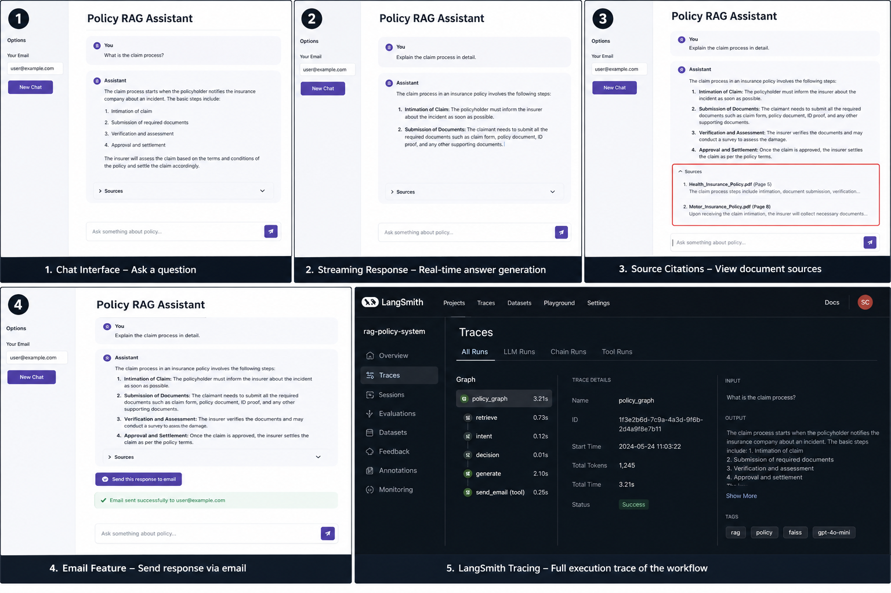

# 📄 RAG-Based Policy Document Assistant (LangChain + LangGraph)

A production-style Retrieval-Augmented Generation (RAG) system for understanding policy documents, built with LangChain, LangGraph, FastAPI, and Streamlit.

---

## 🚀 Features

* 🔍 Semantic Search with FAISS Vector Database
* 🧠 Context-Aware Response Generation using LLM
* 🔁 LangGraph-based Orchestration (modular workflow)
* 🛠️ Tool Integration (Email Notifications)
* 👤 Human-in-the-Loop (HITL) for safe action execution
* 📡 Streaming Responses (real-time UX)
* 📊 LangSmith Tracing (observability & debugging)
* 📚 Source Citations in UI (transparent answers)
* 🖥️ Streamlit Chat Interface with history

---

## 🧠 System Architecture

```
User (Streamlit UI)
        ↓
FastAPI Backend (/chat API)
        ↓
LangGraph Orchestration
        ↓
 ┌───────────────┬───────────────┬───────────────┐
 │ Retriever     │ LLM Generator │ Tool (Email)  │
 └───────────────┴───────────────┴───────────────┘
        ↓
FAISS Vector Store (Embeddings)
```

---

## 📁 Project Structure

```
rag-policy-system/
│
├── app/
│   ├── api/                # FastAPI routes & schemas
│   ├── core/               # Config, logging, tracing
│   ├── rag/                # Retrieval & generation
│   ├── graph/              # LangGraph workflows
│   ├── tools/              # Email tool
│   └── services/           # Email service
│
├── frontend/               # Streamlit UI
├── scripts/                # Ingestion & testing
├── data/                   # Raw documents
├── vectorstore/            # FAISS index
├── logs/                   # Logs
│
├── main.py
├── requirements.txt
└── .env
```

---

## ⚙️ Setup Instructions

### 1️⃣ Clone Repo

```bash
git clone (https://github.com/Aman-Panchal/RAG-System-for-Policy-Document-Understanding-LangGraph.git)
cd rag-policy-system
```

---

### 2️⃣ Install Dependencies

```bash
pip install -r requirements.txt
```

---

### 3️⃣ Setup Environment Variables

Create `.env` file:

```env
OPENAI_API_KEY=your_key

EMAIL_HOST=smtp.gmail.com
EMAIL_PORT=587
EMAIL_USER=your_email
EMAIL_PASSWORD=your_app_password

MODEL_NAME=gpt-4o-mini
EMBEDDING_MODEL=text-embedding-3-small

VECTOR_DB_PATH=vectorstore/faiss_index

LANGCHAIN_TRACING_V2=true
LANGCHAIN_API_KEY=your_langsmith_key
LANGCHAIN_PROJECT=rag-policy-system
```

---

### 4️⃣ Add Documents

Place policy files in:

```
data/raw/
```

---

### 5️⃣ Run Ingestion

```bash
python scripts/ingest_data.py
```

---

### 6️⃣ Start Backend

```bash
uvicorn main:app --reload
```

---

### 7️⃣ Start Frontend

```bash
streamlit run frontend/app.py
```

---

## 🎬 Demo Flow

1. User asks a question (e.g., *“What is claim process?”*)
2. System retrieves relevant document chunks
3. LLM generates context-aware answer
4. Sources are displayed in UI
5. User can click **“Send to Email”**
6. System sends response via email (with HITL control)
7. LangSmith logs full execution trace

---

## 📸 Screenshots

* Chat Interface
* Streaming Response
* Source Citations
* Email Feature
* LangSmith Trace Dashboard

Example:




---

## 📊 Observability (LangSmith)

* Tracks LLM calls and prompts
* Visualizes LangGraph execution
* Monitors latency and token usage

---

## 🧾 Example Query

```
Explain claim process and share via email
```

---

## 🧠 Key Highlights

* Modular graph-based orchestration using LangGraph
* Tool-augmented AI system with real-world actions
* Transparent RAG with source attribution
* Production-ready backend + interactive frontend

---

## 🔮 Future Improvements

* Hybrid Search (BM25 + Vector)
* Reranking for better accuracy
* Feedback loop (user ratings)
* Docker deployment

---

## 👨‍💻 Author

Aman Panchal
LinkedIn : https://www.linkedin.com/in/aman-panchal/
---
